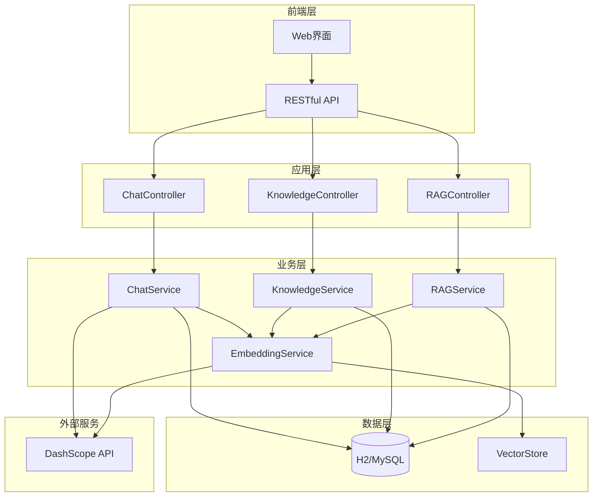

# Spring Alibaba AI 智能客服系统

<div align="center">


**基于Spring Alibaba AI框架构建的企业级智能客服系统**

集成知识库管理、RAG检索增强生成、多轮对话等先进AI技术

[快速开始](#-快速开始) • [功能特性](#-功能特性) • [API文档](#-api文档) • [部署指南](#-部署指南)

</div>

---

## 📋 目录

- [功能特性](#-功能特性)
- [系统架构](#-系统架构)
- [技术栈](#️-技术栈)
- [快速开始](#-快速开始)
- [配置说明](#️-配置说明)
- [API文档](#-api文档)
- [使用示例](#-使用示例)
- [部署指南](#-部署指南)
- [开发指南](#-开发指南)
- [常见问题](#-常见问题)

## 🌟 功能特性

### 🤖 智能对话引擎
- **多模型支持**：集成阿里云DashScope，支持通义千问等大语言模型
- **智能降级**：API密钥未配置时自动使用模拟AI，确保系统可用性
- **上下文理解**：支持多轮对话，智能维护对话上下文
- **个性化回复**：基于用户历史和偏好提供个性化服务

### 📚 知识库管理
- **文档生命周期**：支持文档创建、编辑、发布、归档的完整流程
- **层级分类**：无限级分类系统，灵活组织知识内容
- **权限控制**：细粒度的文档访问和编辑权限管理
- **版本管理**：文档版本控制，支持历史版本回溯
- **统计分析**：访问量、点赞数等多维度数据统计

### 🧠 RAG检索增强生成
- **智能分块**：自动分割长文档，保持语义完整性
- **向量化存储**：文档内容向量化，支持语义相似度搜索
- **混合检索**：结合向量搜索和关键词匹配，提升检索精度
- **实时处理**：异步向量化处理，不影响用户体验
- **智能排序**：基于相关性、质量、时效性的多因子排序算法

### 🤖 智能Agent系统
- **多Agent架构**：支持客服、RAG、工作流等多种专业Agent
- **任务调度**：智能任务分配和负载均衡
- **状态管理**：完整的Agent生命周期管理
- **能力发现**：动态Agent能力注册和发现机制
- **性能监控**：实时Agent性能统计和健康检查

### 🔗 MCP协议支持
- **上下文共享**：Agent间智能上下文共享和同步
- **消息通信**：标准化的Agent间通信协议
- **会话管理**：跨Agent的会话状态维护
- **事件驱动**：基于事件的异步消息处理
- **协议扩展**：可扩展的消息类型和处理器

### ⚡ 工作流引擎
- **可视化设计**：支持拖拽式工作流设计
- **多步骤支持**：串行、并行、条件分支等复杂流程
- **Agent集成**：无缝集成各类智能Agent
- **状态追踪**：实时工作流执行状态监控
- **错误处理**：完善的异常处理和重试机制

### 🔧 系统特性
- **高可用性**：支持集群部署，具备故障自动恢复能力
- **可扩展性**：模块化设计，支持功能插件化扩展
- **监控告警**：完善的健康检查和性能监控机制
- **安全保障**：数据加密、访问控制、审计日志等安全措施

## 🏗️ 系统架构



## 🛠️ 技术栈

<table>
<tr>
<td width="50%">

### 🔧 核心框架
- **Java 21** - 现代化JVM语言特性
- **Spring Boot 3.3.3** - 企业级应用框架
- **Spring Alibaba AI 1.0.0.2** - AI集成框架
- **Spring Data JPA** - 数据持久化抽象层
- **Maven** - 依赖管理和构建工具

### 🤖 AI技术
- **DashScope** - 阿里云大语言模型服务
- **Spring AI** - AI应用开发框架
- **Embedding Model** - 文本向量化模型
- **RAG Pipeline** - 检索增强生成管道

### 🤖 Agent技术
- **Agent Framework** - 智能Agent开发框架
- **Task Scheduler** - 任务调度和分配引擎
- **MCP Protocol** - 模型上下文协议
- **Workflow Engine** - 工作流执行引擎

</td>
<td width="50%">

### 💾 数据存储
- **H2 Database** - 内存数据库（开发/演示）
- **MySQL/PostgreSQL** - 生产环境关系型数据库
- **Vector Storage** - 向量数据存储和检索
- **JPA/Hibernate** - ORM框架

### 🌐 Web技术
- **Thymeleaf** - 服务端模板引擎
- **RESTful API** - 标准化接口设计
- **JSON** - 数据交换格式
- **WebSocket** - 实时通信（可选）

</td>
</tr>
</table>

## 🚀 快速开始

### 📋 环境要求

| 组件 | 版本要求 | 说明 |
|------|----------|------|
| Java | 21+ | 推荐使用OpenJDK 21 |
| Maven | 3.6+ | 项目构建工具 |
| 内存 | 2GB+ | 推荐4GB以上 |
| 磁盘 | 1GB+ | 用于数据库和日志存储 |

### ⚡ 一键启动

```bash
# 1. 克隆项目
git clone https://github.com/your-repo/spring-alibaba-ai-customer-service.git
cd spring-alibaba-ai-customer-service

# 2. 启动应用（使用内置模拟AI）
mvn spring-boot:run

# 3. 访问应用
open http://localhost:8080
```

> 🎉 **恭喜！** 应用已启动，您可以立即体验智能客服功能。

### 🔑 配置真实AI（可选）

如需使用阿里云DashScope真实AI能力：

<details>
<summary>点击展开配置步骤</summary>

#### 1. 获取API密钥
- 访问 [阿里云DashScope控制台](https://dashscope.console.aliyun.com/)
- 注册并开通服务
- 获取API密钥

#### 2. 配置密钥
**方式一：环境变量（推荐）**
```bash
export DASHSCOPE_API_KEY=your-api-key-here
mvn spring-boot:run
```

**方式二：配置文件**
```yaml
# src/main/resources/application.yml
spring:
  ai:
    dashscope:
      api-key: your-api-key-here
```

</details>

### 🧠 启用RAG功能（可选）

<details>
<summary>点击展开RAG配置</summary>

RAG功能默认启用，可根据需要调整参数：

```yaml
# application.yml
rag:
  enabled: true
  chunk:
    size: 1000        # 文档分块大小
    overlap: 200      # 分块重叠长度
  retrieval:
    max-chunks: 5     # 最大检索分块数
    similarity-threshold: 0.7  # 相似度阈值
  context:
    max-length: 2000  # 最大上下文长度
```

</details>

### 🌐 访问地址

| 服务 | 地址 | 说明 |
|------|------|------|
| 🏠 **主页** | http://localhost:8080 | Web聊天界面 |
| 🔍 **API文档** | http://localhost:8080/api/chat/health | 健康检查 |
| 🧠 **RAG监控** | http://localhost:8080/api/rag/health | RAG功能状态 |
| 💾 **数据库** | http://localhost:8080/h2-console | H2控制台 |

<details>
<summary>H2数据库连接信息</summary>

- **JDBC URL**: `jdbc:h2:mem:testdb`
- **用户名**: `sa`
- **密码**: 空

</details>

## 📡 API文档

### 🤖 聊天API

<table>
<tr>
<td width="30%"><strong>发送消息</strong></td>
<td width="70%">

```http
POST /api/chat/message
Content-Type: application/json

{
  "message": "您好，我想咨询一下产品信息",
  "sessionId": "可选，会话ID",
  "userId": "可选，用户ID"
}
```

</td>
</tr>
<tr>
<td><strong>获取会话历史</strong></td>
<td>

```http
GET /api/chat/history/{sessionId}
```

</td>
</tr>
<tr>
<td><strong>健康检查</strong></td>
<td>

```http
GET /api/chat/health
```

</td>
</tr>
</table>

### 📚 知识库API

<details>
<summary><strong>分类管理</strong></summary>

```http
# 创建分类
POST /api/knowledge/categories
{
  "name": "产品介绍",
  "description": "产品相关的知识文档",
  "parentId": null,
  "status": "ACTIVE"
}

# 获取分类列表
GET /api/knowledge/categories/top-level

# 获取子分类
GET /api/knowledge/categories/{parentId}/children

# 搜索分类
GET /api/knowledge/categories/search?keyword=产品
```

</details>

<details>
<summary><strong>文档管理</strong></summary>

```http
# 创建文档
POST /api/knowledge/documents
{
  "title": "产品功能介绍",
  "content": "详细的产品功能说明...",
  "summary": "产品功能概述",
  "category": {"id": 1},
  "tags": "产品,功能,介绍"
}

# 发布文档
POST /api/knowledge/documents/{id}/publish

# 获取文档详情
GET /api/knowledge/documents/{id}

# 搜索文档
GET /api/knowledge/documents/search?keyword=功能

# 智能搜索
POST /api/knowledge/documents/search/smart?query=产品功能
```

</details>

### 🧠 RAG API

<details>
<summary><strong>检索功能</strong></summary>

```http
# RAG搜索（推荐）
POST /api/rag/search?query=产品功能&maxResults=5

# 向量相似度搜索
POST /api/rag/vector-search?query=产品介绍&topK=10

# 混合搜索
POST /api/rag/hybrid-search?query=价格信息&topK=10

# 评估查询匹配度
POST /api/rag/evaluate?query=用户查询内容
```

</details>

<details>
<summary><strong>管理功能</strong></summary>

```http
# 获取RAG统计信息
GET /api/rag/statistics

# RAG健康检查
GET /api/rag/health

# 重新处理失败的分块
POST /api/rag/reprocess-failed
```

</details>

### 🤖 Agent API

<details>
<summary><strong>Agent管理</strong></summary>

```http
# 获取所有Agent
GET /api/agents

# 获取指定Agent信息
GET /api/agents/{agentId}

# 获取Agent统计信息
GET /api/agents/{agentId}/statistics

# 启动Agent
POST /api/agents/{agentId}/start

# 停止Agent
POST /api/agents/{agentId}/stop

# 暂停Agent
POST /api/agents/{agentId}/pause

# 恢复Agent
POST /api/agents/{agentId}/resume
```

</details>

<details>
<summary><strong>任务执行</strong></summary>

```http
# 执行Agent任务
POST /api/agents/execute
Content-Type: application/json

{
  "taskType": "customer_inquiry",
  "parameters": {
    "message": "用户咨询内容",
    "userId": "user123",
    "sessionId": "session456"
  },
  "priority": 5
}

# 批量执行任务
POST /api/agents/execute/batch
Content-Type: application/json

{
  "tasks": [
    {
      "taskType": "rag_search",
      "parameters": {"query": "产品信息"}
    }
  ]
}

# 获取任务结果
GET /api/agents/tasks/{taskId}/result
```

</details>

### ⚡ 工作流API

<details>
<summary><strong>工作流管理</strong></summary>

```http
# 创建工作流
POST /api/workflows
Content-Type: application/json

{
  "name": "客服处理流程",
  "description": "标准客服处理工作流",
  "steps": [
    {
      "id": "step1",
      "name": "接收咨询",
      "type": "agent_task",
      "parameters": {
        "agentType": "customer_service"
      }
    }
  ]
}

# 获取工作流列表
GET /api/workflows

# 获取工作流详情
GET /api/workflows/{workflowId}

# 更新工作流
PUT /api/workflows/{workflowId}

# 删除工作流
DELETE /api/workflows/{workflowId}
```

</details>

<details>
<summary><strong>工作流执行</strong></summary>

```http
# 启动工作流
POST /api/workflows/{workflowId}/execute
Content-Type: application/json

{
  "variables": {
    "userId": "user123",
    "sessionId": "session456"
  }
}

# 获取执行状态
GET /api/workflows/executions/{executionId}

# 获取执行历史
GET /api/workflows/{workflowId}/executions

# 停止执行
POST /api/workflows/executions/{executionId}/stop
```

</details>

## 📁 项目结构

```
spring-alibaba-ai-customer-service/
├── 📁 src/main/java/com/example/customerservice/
│   ├── 🎮 controller/           # REST API控制器
│   │   ├── ChatController.java
│   │   ├── KnowledgeController.java
│   │   └── RAGController.java
│   ├── 🔧 service/              # 业务逻辑层
│   │   ├── ChatService.java
│   │   ├── KnowledgeService.java
│   │   ├── RAGService.java
│   │   ├── EmbeddingService.java
│   │   └── VectorStoreService.java
│   ├── 📊 entity/               # 数据实体
│   │   ├── ChatSession.java
│   │   ├── KnowledgeDocument.java
│   │   ├── DocumentChunk.java
│   │   └── KnowledgeCategory.java
│   ├── 💾 repository/           # 数据访问层
│   ├── 📋 dto/                  # 数据传输对象
│   ├── ⚙️ config/               # 配置类
│   └── 🚀 CustomerServiceApplication.java
├── 📁 src/main/resources/
│   ├── 🎨 templates/            # Web模板
│   ├── 📄 application.yml       # 主配置文件
│   └── 📄 data.sql             # 初始化数据
└── 📁 src/test/                 # 测试代码
```

## � 使用示例

### 🎯 完整体验流程

<details>
<summary><strong>1️⃣ 创建知识库内容</strong></summary>

```bash
# 创建产品分类
curl -X POST http://localhost:8080/api/knowledge/categories \
  -H "Content-Type: application/json" \
  -d '{
    "name": "产品介绍",
    "description": "产品相关知识文档",
    "status": "ACTIVE"
  }'

# 创建功能文档
curl -X POST http://localhost:8080/api/knowledge/documents \
  -H "Content-Type: application/json" \
  -d '{
    "title": "AI客服系统核心功能",
    "content": "本系统提供智能对话、知识库管理、RAG检索增强等功能。支持多轮对话、上下文理解，基于知识库内容提供精准回答。具备文档分块、向量化存储、语义搜索等先进技术。",
    "summary": "AI客服系统功能概述",
    "category": {"id": 1},
    "tags": "AI,客服,功能,RAG"
  }'

# 发布文档
curl -X POST http://localhost:8080/api/knowledge/documents/1/publish
```

</details>

<details>
<summary><strong>2️⃣ 测试RAG检索</strong></summary>

```bash
# 测试智能搜索
curl -X POST "http://localhost:8080/api/rag/search?query=AI客服有什么功能&maxResults=3"

# 测试混合检索
curl -X POST "http://localhost:8080/api/rag/hybrid-search?query=智能对话功能&topK=5"

# 查看处理统计
curl -X GET http://localhost:8080/api/rag/statistics
```

</details>

<details>
<summary><strong>3️⃣ 体验智能对话</strong></summary>

```bash
# 发送问题，体验RAG增强回答
curl -X POST http://localhost:8080/api/chat/message \
  -H "Content-Type: application/json" \
  -d '{
    "sessionId": "demo-session-001",
    "userId": "demo-user",
    "message": "请详细介绍一下这个AI客服系统的功能特点"
  }'
```

</details>

<details>
<summary><strong>4️⃣ 体验Agent功能</strong></summary>

```bash
# 查看可用Agent
curl -X GET http://localhost:8080/api/agents

# 执行客服Agent任务
curl -X POST http://localhost:8080/api/agents/execute \
  -H "Content-Type: application/json" \
  -d '{
    "taskType": "customer_inquiry",
    "parameters": {
      "message": "我想了解产品功能",
      "userId": "demo-user",
      "sessionId": "demo-session"
    }
  }'

# 执行RAG Agent任务
curl -X POST http://localhost:8080/api/agents/execute \
  -H "Content-Type: application/json" \
  -d '{
    "taskType": "rag_search",
    "parameters": {
      "query": "产品特性介绍",
      "maxResults": 5
    }
  }'
```

</details>

<details>
<summary><strong>5️⃣ 创建和执行工作流</strong></summary>

```bash
# 创建客服处理工作流
curl -X POST http://localhost:8080/api/workflows \
  -H "Content-Type: application/json" \
  -d '{
    "name": "智能客服处理流程",
    "description": "包含RAG检索和智能回复的完整客服流程",
    "steps": [
      {
        "id": "rag-search",
        "name": "知识检索",
        "type": "agent_task",
        "parameters": {
          "agentType": "rag",
          "taskType": "rag_search"
        }
      },
      {
        "id": "generate-response",
        "name": "生成回复",
        "type": "agent_task",
        "parameters": {
          "agentType": "customer_service",
          "taskType": "customer_inquiry"
        }
      }
    ]
  }'

# 执行工作流
curl -X POST http://localhost:8080/api/workflows/1/execute \
  -H "Content-Type: application/json" \
  -d '{
    "variables": {
      "userQuery": "请介绍产品功能",
      "userId": "demo-user",
      "sessionId": "demo-session"
    }
  }'
```

</details>

## ⚙️ 配置说明

### 📋 核心配置

<details>
<summary><strong>基础配置</strong></summary>

```yaml
# application.yml
customer-service:
  welcome-message: "您好！我是AI智能客服..."
  system-prompt: "你是一个专业的客服助手..."
  session-timeout: 30  # 会话超时(分钟)
  cleanup-interval: 60 # 清理间隔(分钟)
```

</details>

<details>
<summary><strong>RAG配置</strong></summary>

```yaml
rag:
  enabled: true
  chunk:
    size: 1000           # 分块大小
    overlap: 200         # 重叠长度
  embedding:
    enabled: true        # 启用向量化
    batch-size: 10       # 批处理大小
  retrieval:
    max-chunks: 5        # 最大检索分块
    similarity-threshold: 0.7  # 相似度阈值
  context:
    max-length: 2000     # 最大上下文长度
    include-metadata: true
    deduplicate: true
```

</details>

<details>
<summary><strong>Agent配置</strong></summary>

```yaml
agent:
  enabled: true
  manager:
    auto-start: true     # 自动启动Agent
    health-check-interval: 30000  # 健康检查间隔(ms)
  customer-service:
    max-concurrent-tasks: 10      # 最大并发任务数
    max-task-duration: 300000     # 最大任务时长(ms)
  rag:
    max-concurrent-tasks: 20      # RAG Agent并发数
    max-task-duration: 60000      # RAG任务超时时间
  mcp:
    enabled: true        # 启用MCP协议
    context-cleanup-interval: 3600000  # 上下文清理间隔(ms)
    max-context-age: 86400000     # 最大上下文年龄(ms)
```

</details>

<details>
<summary><strong>工作流配置</strong></summary>

```yaml
workflow:
  enabled: true
  engine:
    max-concurrent-executions: 50  # 最大并发执行数
    execution-timeout: 1800000     # 执行超时时间(ms)
    retry-attempts: 3              # 重试次数
  storage:
    cleanup-completed-after: 604800000  # 清理已完成执行(ms)
    max-execution-history: 1000         # 最大执行历史数
```

</details>

<details>
<summary><strong>数据库配置</strong></summary>

```yaml
# 开发环境 - H2
spring:
  datasource:
    url: jdbc:h2:mem:testdb
    driver-class-name: org.h2.Driver
  h2:
    console:
      enabled: true

# 生产环境 - MySQL
spring:
  datasource:
    url: jdbc:mysql://localhost:3306/customer_service
    username: ${DB_USERNAME:root}
    password: ${DB_PASSWORD:password}
    driver-class-name: com.mysql.cj.jdbc.Driver
```

</details>

## 🛠️ 部署指南

### 🐳 Docker部署（推荐）

<details>
<summary><strong>Docker Compose部署</strong></summary>

```yaml
# docker-compose.yml
version: '3.8'
services:
  app:
    build: .
    ports:
      - "8080:8080"
    environment:
      - SPRING_PROFILES_ACTIVE=prod
      - DASHSCOPE_API_KEY=${DASHSCOPE_API_KEY}
      - DB_HOST=mysql
      - DB_USERNAME=root
      - DB_PASSWORD=password
    depends_on:
      - mysql

  mysql:
    image: mysql:8.0
    environment:
      MYSQL_ROOT_PASSWORD: password
      MYSQL_DATABASE: customer_service
    volumes:
      - mysql_data:/var/lib/mysql

volumes:
  mysql_data:
```

```bash
# 启动服务
docker-compose up -d

# 查看日志
docker-compose logs -f app
```

</details>

### ☁️ 云平台部署

<details>
<summary><strong>阿里云ECS部署</strong></summary>

1. **准备环境**
```bash
# 安装Java 21
sudo yum install -y java-21-openjdk

# 安装MySQL
sudo yum install -y mysql-server
```

2. **配置数据库**
```sql
CREATE DATABASE customer_service;
CREATE USER 'app_user'@'%' IDENTIFIED BY 'secure_password';
GRANT ALL PRIVILEGES ON customer_service.* TO 'app_user'@'%';
```

3. **部署应用**
```bash
# 上传JAR包
scp target/customer-service-*.jar user@server:/opt/app/

# 启动服务
java -jar -Dspring.profiles.active=prod customer-service-*.jar
```

</details>

## 👨‍💻 开发指南

### 🏗️ 架构原则

- **分层架构**: Controller → Service → Repository
- **依赖注入**: 使用Spring IoC容器管理依赖
- **异步处理**: 耗时操作使用@Async异步执行
- **事务管理**: 使用@Transactional确保数据一致性

### 🔧 开发流程

<details>
<summary><strong>添加新功能</strong></summary>

1. **创建实体类**
```java
@Entity
@Table(name = "new_entity")
public class NewEntity {
    // 实体定义
}
```

2. **创建Repository**
```java
@Repository
public interface NewEntityRepository extends JpaRepository<NewEntity, Long> {
    // 自定义查询方法
}
```

3. **创建Service**
```java
@Service
@Transactional
public class NewEntityService {
    // 业务逻辑
}
```

4. **创建Controller**
```java
@RestController
@RequestMapping("/api/new-entity")
public class NewEntityController {
    // REST API端点
}
```

</details>

### 🧪 测试指南

<details>
<summary><strong>单元测试</strong></summary>

```java
@SpringBootTest
@TestPropertySource(locations = "classpath:application-test.yml")
class ServiceTest {

    @Autowired
    private YourService yourService;

    @Test
    void testMethod() {
        // 测试逻辑
    }
}
```

</details>

## ❓ 常见问题

### 🔧 配置相关

<details>
<summary><strong>Q: 如何获取DashScope API密钥？</strong></summary>

**A:**
1. 访问 [阿里云DashScope控制台](https://dashscope.console.aliyun.com/)
2. 注册并实名认证
3. 开通DashScope服务
4. 在API密钥管理页面创建密钥

</details>

<details>
<summary><strong>Q: 支持哪些数据库？</strong></summary>

**A:** 支持所有JPA兼容的数据库：
- **开发**: H2 (内存数据库)
- **生产**: MySQL 8.0+, PostgreSQL 12+, Oracle 19c+

</details>

### 🧠 RAG相关

<details>
<summary><strong>Q: 如何优化RAG检索效果？</strong></summary>

**A:** 调整以下参数：

| 参数 | 作用 | 建议值 |
|------|------|--------|
| `rag.chunk.size` | 分块大小 | 500-1500字符 |
| `rag.retrieval.similarity-threshold` | 相似度阈值 | 0.6-0.8 |
| `rag.retrieval.max-chunks` | 最大检索数 | 3-10个 |

</details>

<details>
<summary><strong>Q: 文档向量化失败怎么办？</strong></summary>

**A:** 排查步骤：
1. 检查EmbeddingModel配置
2. 验证文档内容格式
3. 查看错误日志
4. 使用 `/api/rag/reprocess-failed` 重试

</details>

### 🤖 Agent相关

<details>
<summary><strong>Q: 如何创建自定义Agent？</strong></summary>

**A:** 创建步骤：
1. 继承 `AbstractAgent` 类
2. 实现 `doExecute()` 方法
3. 定义 `AgentCapabilities`
4. 注册到 `AgentManager`
5. 配置支持的任务类型

</details>

<details>
<summary><strong>Q: Agent任务执行失败怎么办？</strong></summary>

**A:** 排查步骤：
1. 检查Agent状态和健康状况
2. 验证任务参数和类型
3. 查看Agent执行日志
4. 检查依赖服务状态
5. 使用重试机制或手动重新执行

</details>

<details>
<summary><strong>Q: 如何监控Agent性能？</strong></summary>

**A:** 监控方法：
- 使用 `/api/agents/{agentId}/statistics` 查看统计
- 监控任务成功率和执行时间
- 设置健康检查告警
- 查看系统整体统计信息

</details>

### ⚡ 工作流相关

<details>
<summary><strong>Q: 工作流执行卡住怎么办？</strong></summary>

**A:** 解决方案：
1. 检查工作流执行状态
2. 查看当前执行步骤
3. 检查步骤依赖和条件
4. 手动停止并重新执行
5. 检查超时配置

</details>

<details>
<summary><strong>Q: 如何设计复杂工作流？</strong></summary>

**A:** 设计原则：
- 合理划分步骤粒度
- 设置适当的超时和重试
- 使用条件分支处理异常
- 添加人工干预步骤
- 考虑并行执行优化

</details>

### 🚀 性能优化

<details>
<summary><strong>Q: 如何提升系统性能？</strong></summary>

**A:** 优化建议：
- **数据库**: 添加索引，使用连接池
- **缓存**: 启用Redis缓存热点数据
- **异步**: 使用消息队列处理耗时任务
- **监控**: 集成APM工具监控性能
- **Agent**: 调整并发数和超时配置
- **工作流**: 优化步骤设计和并行执行

</details>

## 📄 许可证

本项目采用 [MIT License](LICENSE) 开源协议。

## 🤝 贡献指南

我们欢迎所有形式的贡献！

### 🐛 报告问题
- 使用 [GitHub Issues](../../issues) 报告Bug
- 提供详细的复现步骤和环境信息

### 💡 功能建议
- 在Issues中提出新功能建议
- 描述使用场景和预期效果

### 🔧 代码贡献
1. Fork本项目
2. 创建功能分支: `git checkout -b feature/amazing-feature`
3. 提交更改: `git commit -m 'Add amazing feature'`
4. 推送分支: `git push origin feature/amazing-feature`
5. 提交Pull Request

## 📞 联系我们

- 📧 **邮箱**: [your-email@example.com](mailto:your-email@example.com)
- 💬 **讨论**: [GitHub Discussions](../../discussions)
- 🐛 **问题**: [GitHub Issues](../../issues)

---

<div align="center">

**⭐ 如果这个项目对您有帮助，请给我们一个Star！**

Made with ❤️ by [Your Team Name]

</div>
